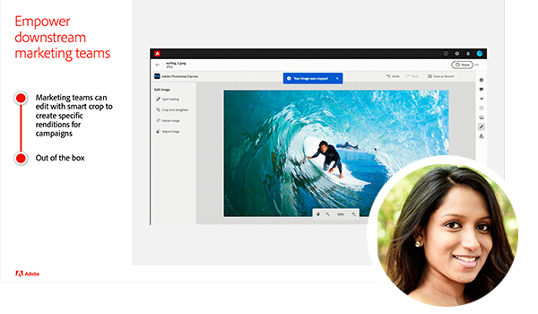

# Adobe 컨텐츠 관리 포럼 {#overview}

컨텐츠 관리 전략의 현재와 미래 상태, 제공 서비스, 과제 및 기술 요구 사항에 대해 논의하는 Adobe 전문가로부터 배워 보십시오. 이 가상 이벤트에는 NFL 쿼터백이자 비즈니스 컨설턴트인 Kurt Benkert와 전략 및 제품 마케팅 Director Haresh Kumar의 특별한 기조가 포함되어 있습니다. 이들은 컨텐츠 속도의 힘을 발휘하기 위해 크리에이티브 자산에 액세스하고 일상적인 작업을 간소화하는 데 어떻게 도움이 되는지에 대해 설명합니다.

아래 세션에 참여하여 알아보십시오.

* 콘텐츠 작성을 대중화하고, 옴니채널 제공을 용이하게 하고, 모든 경험을 카운트할 수 있도록 개인화 수준을 확장하는 경험 관리를 현대화하는 방법입니다.
* 개인화에 맞게 확장되는 콘텐츠 공급망을 구축하는 방법
* 새로운 사이트 생성을 위한 시장 출시 시간을 단축하고 기술 리소스에 대한 의존도를 줄이는 방법
* Experience Manager을 위한 최신 혁신 기술은 클라우드 네이티브 서비스로 제공되며, 앞서가면서 끊임없이 변화하는 시장의 기대에 적응하는 방법입니다
* GraphQL 및 콘텐츠 조각을 사용하여 Adobe Experience Manager as a Headless CMS로 보다 빠르게 사이트를 구축하는 방법
* Adobe Experience Manager Sites의 시장 출시 시간을 단축하는 개발자 우수 사례

>[!TIP]
>
>**기록된 모든 세션이 왼쪽의 탐색에 나열됩니다**.

<table>
  <tr>
   <td>
      
      

         <a href="2022/welcome.md"><strong>시작 주소 및 AEM 개요</strong></a>         
          <em>엘리엇 세데가와 하레쉬 쿠마르, 그리고 커트 벤커트가</em>
      

      

         
         Adobe 컨텐츠 관리 포럼 이벤트 시리즈를 시작합니다. 이 비디오에서는 시작 주소를 보고 AEM 개요를 확인하고 컨텐츠 속도 향상에 대해 알아볼 수 있습니다.
      

   </td>
   <td>
      
      

         <a href="2022/assets-for-all.md"><strong>Adobe App Builder를 사용하여 Adobe Experience Manager Headless 확장</strong></a>         
          <em>Purnima Rachoor Roy와 함께</em>
      

      

         
          Assets Essentials이 부서 및 중견기업을 위한 새로운 디지털 자산 관리 시스템인 방법에 대해 알아봅니다.
      

   </td>
   <td>
      
      

         <a href="2022/supply-chain.md"><strong>확장 가능한 콘텐츠 공급망 구축</strong></a>         
          <em>마크 안젤리노비치</em>
      

      

         
         개인화에 맞게 확장되는 콘텐츠 공급망을 구축하는 방법을 알아봅니다.
      

   </td>
  </tr>
</table>
