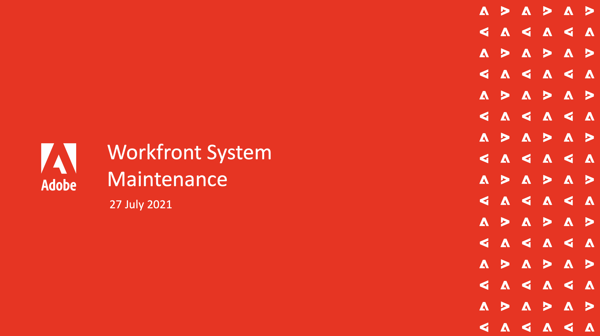

# Adobe 고객 성공 웨비나 {#adobe-customer-success-webinars}

Adobe 고객 성공 주도 웨비나는 Adobe의 Experience Cloud에 대한 투자를 최적화할 수 있도록 설계되었습니다. 가치를 극대화하고 Adobe 솔루션 채택을 늘릴 수 있는 유용한 통찰력을 얻으십시오.

<!-- 
## Featured Sessions

<table>
  <tr>
   <td>
      
      

         <a href="user-groups/workfront-system-maintenance.md"><strong>Workfront System Maintenance</strong></a>
          <em>foo</em>
      

      

         
         A panel of system administrators discuss things to consider about system setup, regular maintenance, and clean-up.
      

    </td>
   <td>
      
      

         <a href="user-groups/reporting-and-dashboards.md"><strong>Reporting & Dashboards</strong></a>
          <em>foo</em> 
      

      

         
         See reports and dashboards others have created for their organizations and the best practices they’ve learned.
      

    </td>
   <td>
      
      

         <a href="user-groups/agile-in-marketing.md"><strong>Agile in Marketing</strong></a>
          <em>foo</em> 
      

      

         
         Agile experts discuss the high points and trends they've seen with agile, general agility in business, and how they use Workfront for agile.
      

    </td>
  </tr>
</table>

-->
