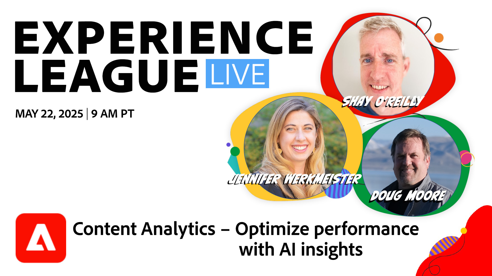

# Content Analytics - AI 인사이트를 통해 성능 최적화

Adobe의 최첨단 AI 기술을 기반으로 하는 혁신적인 콘텐츠 분석 세계를 살펴볼 수 있는 통찰력 있는 1시간 웨비나에 참여해 보십시오. 이 세션에서는 콘텐츠 분석이 콘텐츠 성능을 측정, 이해 및 최적화하는 방법에 혁명을 가져올 수 있는 방법을 살펴봅니다.

이 세션에서는 다음 방법을 배웁니다. 
* AI가 에셋(이미지)과 경험(텍스트, CTA)을 분석하여 대상자에게 어떤 반향을 불러일으키는지 정확히 알아봅니다. 

* 전환 및 다운로드와 같은 KPI에 콘텐츠를 연결하여 활용도가 낮은 에셋을 식별하고, 콘텐츠 피로를 줄이고, 예산을 최적화합니다. 

* Content Analytics에서 대상 환경 설정을 표시하여 사용자를 위한 경험을 맞춤화하는 방법에 대해 알아보십시오. 

* 자산 축소판 및 세부 보기와 같은 새로운 Adobe 도구를 탐색하여 콘텐츠 통찰력을 시각화하고 조치를 취하십시오. 

**YouTube에서 미리 알림을 설정하려면 이미지를 클릭하십시오**
