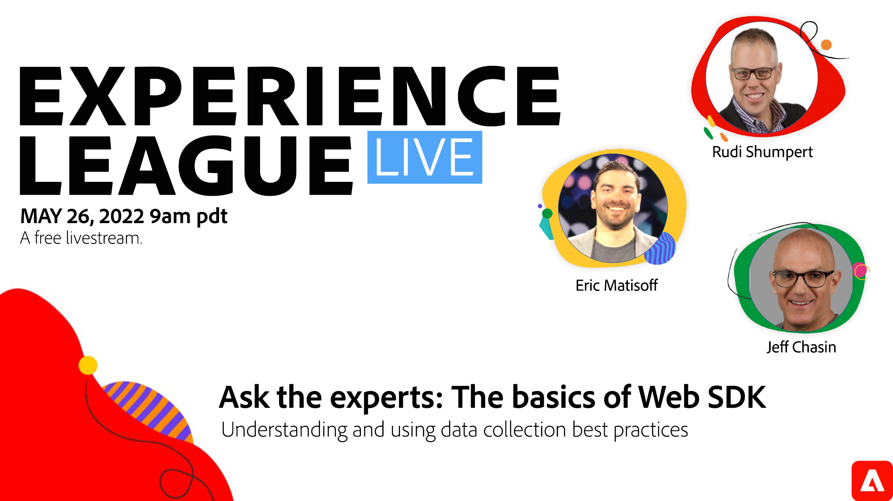

# Experience League LIVE

Experience League LIVE는 Experience League 팀에서 제작한 라이브 스트리밍 쇼입니다.  Adobe 제품 전문가를 만나고 Adobe Experience Cloud 애플리케이션에 적용할 수 있는 유용한 팁, 요령 및 전략을 배울 수 있는 기회입니다.

## 다가오는 Experience League LIVE 이벤트

<table>
<tr>
  <td style="vertical-align: top;">
    

      <a href="episodes/exl-live-episode-8-23-23.md">
        <strong>Adobe Journey Optimizer의 API 트리거 메시징</strong>
      </a>
       <em>산드라 하우스만, 싯다르트 자인, 니킬 샤르마, 체탄 프라사드와 함께</em>
       <em>2023년 8월 23일</em>
    

  </td>
</tr>
</table>

## 직원 추천

<table style="max-width: 1214px;">

<tr>
  <td style="vertical-align: top;">
    

      <a href="/help/experience-league-live/episodes/exl-live-episode-04-21-22.md">
        <strong>AEM from Headful to Headless</strong>
      </a>
       <em>대니 고든, 아몰 아난드, 사친 말리, 그리고 션 스티머와 함께</em>
       <em>2022년 4월 21일</em>
    

  </td>

<td style="vertical-align: top;">
    
    

      <a href="episodes/exl-live-episode-08.md"><strong>Customer Journey Analytics - 인사이드 스쿠프</strong></a>
       <em>트레버 폴슨, 로히트 고세인, 알렉스 스트런과 함께</em>
       <em>2021년 1월 25일</em>
    

  </td>

<td style="vertical-align: top;">
    
    

      <a href="episodes/exl-live-episode-05-26-22.md">
        <strong>전문가에게 질문하기: Web SDK 기본 사항</strong>
      </a>
       <em>Rudi Shumpert, Jeff Chasin 및 Eric Matisoff와 함께</em>
       <em>2022년 5월 26일</em>
    

  </td>
  </tr>

</table>

>[!TIP]
>
>기타 학습 방법에 대해서는 당사의 무료 [교육 과정](https://experienceleague.adobe.com/#dashboard/learning)과 개별적인 [튜토리얼](https://experienceleague.adobe.com/docs/home-tutorials.html?lang=ko-KR)을 살펴보시기 바랍니다.
