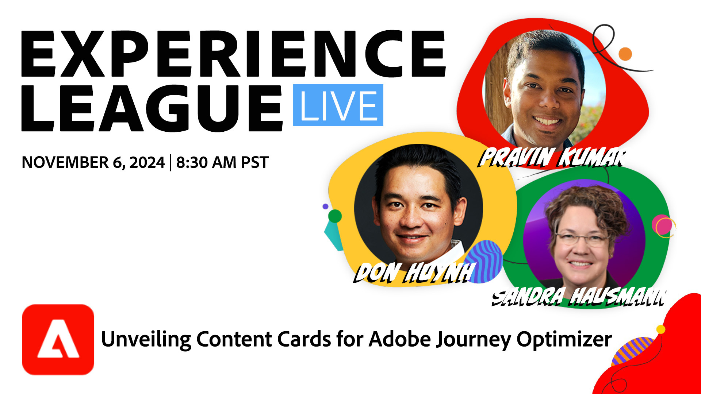

# Experience League LIVE

Experience League 라이브는 Experience League 팀이 제작하는 라이브 스트리밍 쇼입니다.  Adobe 제품 전문가를 만나고 Adobe Experience Cloud 애플리케이션에 적용할 수 있는 유용한 팁, 요령 및 전략을 배울 수 있는 기회입니다.

## 예정된 Experience League 라이브 이벤트

<table>
<tr>

<td style="vertical-align: top;">
    

      <a href="episodes/exl-live-episode-10-30-24.md"><strong>사용자 참여를 향상시키고 모바일 및 웹 응용 프로그램 간의 대화를 활성화하기 위해 고안된 Adobe Journey Optimizer의 새로운 다목적 메시징 채널인 Content Cards에 대해 알아봅니다. </strong></a>
       <em>돈 후인, 프라빈 쿠마르와 함께</em>
       <em>2024년 11월 6일 오후 8시 30분</em>
        <a href="https://engage.adobe.com/ExpLeagueLive-241030.html?s_rtid=7015Y0000048hxzQAA&amp;s_iid=&amp;sfid=&amp;acctid=&amp;ecp=">이 이벤트에 등록</a>
    

  </td>
</tr>
</table>

## 직원 추천

<table style="max-width: 1214px;">

<tr>
  <td style="vertical-align: top;">
    

      <a href="episodes/exl-live-episode-06-26-24.md">
        <strong>최신 Adobe Real-Time CDP 릴리스를 통해 비즈니스에 도움이 되는 방법</strong>
      </a>
       <em>Nina Caruso, Rudi Shumpert 및 Doug Moore와 함께</em>
       <em>2024년 6월 26일</em>
    

  </td>

<td style="vertical-align: top;">
    
    

      <a href="episodes/exl-live-episode-05-16-24.md"><strong>Analytics를 Web SDK로 마이그레이션하는 방법</strong></a>
       <em>Mitch Rice, Joe Koury 및 Doug Moore와 함께</em>
       <em>2024년 5월 16일</em>
    

  </td>

<td style="vertical-align: top;">
    
    

      <a href="episodes/exl-live-episode-04-24-24.md">
        <strong>Journey Optimizer의 새 코드 기반 경험 채널</strong>
      </a>
       <em>Sandra Hausmann, Robert Calangiu 및 Brent Kostak과 함께</em>
       <em>2024년 4월 24일</em>
    

  </td>
  </tr>

</table>

>[!TIP]
>
>기타 학습 방법에 대해서는 무료 [과정](https://experienceleague.adobe.com/#dashboard/learning)과 개별 [튜토리얼](https://experienceleague.adobe.com/docs/home-tutorials.html?lang=ko-KR)을 확인하세요.
