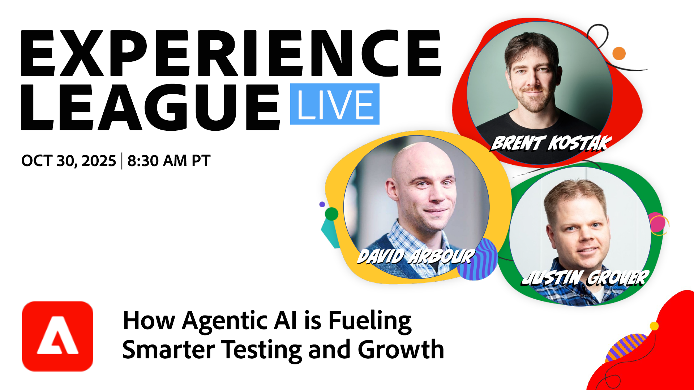
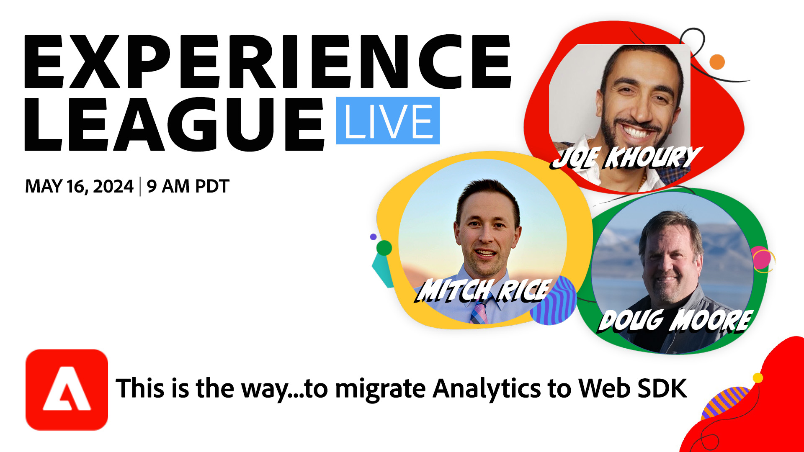

# Experience League LIVE

Experience League LIVE는 Experience League 팀에서 제작한 라이브 스트리밍 쇼입니다.  Adobe 제품 전문가를 만나고 Adobe Experience Cloud 애플리케이션에 적용할 유용한 팁과 요령, 전략을 배울 수 있는 기회입니다.

## 예정된 Experience League LIVE 이벤트

<table>
    <tr>
        <td style="vertical-align: top;">
            

              <a href="episodes/exl-live-episode-10-22-25.md">
                <strong>Adobe Experience Platform Agent Orchestrator을 통한 차세대 고객 경험 및 효율성</strong>
              </a>
               <em>다니엘 라이트, 나미타 크리쉬난, 후옹 부, 콜 코넬리와 함께</em>
               <em>2025년 10월 22일</em>
            

        </td>
         <td style="vertical-align: top;">
            

              <a href="episodes/exl-live-episode-10-30-25.md">
                <strong>다음 실험 시대: Agentic AI가 어떻게 더 스마트한 테스트와 성장을 촉진하고 있는지</strong>
              </a>
               <em>산드라 하우스만, 브렌트 코스타크, 저스틴 그로버, 데이비드 아버(David Arbour)와 함께</em>
               <em>2025년 10월 30일</em>
            

        </td>
    </tr>

</table>

## 직원 추천

<table style="max-width: 1214px;">

<tr>
  <td style="vertical-align: top;">
    

      <a href="episodes/exl-live-episode-06-26-24.md">
        <strong>최신 Adobe Real-Time CDP 릴리스를 통해 비즈니스에 도움이 되는 방법</strong>
      </a>
       <em>Nina Caruso, Rudi Shumpert 및 Doug Moore와 함께</em>
       <em>2024년 6월 26일</em>
    

  </td>

<td style="vertical-align: top;">
    
    

      <a href="episodes/exl-live-episode-05-16-24.md"><strong>Analytics를 웹 SDK으로 마이그레이션하는 방법</strong></a>
       <em>Mitch Rice, Joe Koury 및 Doug Moore와 함께</em>
       <em>2024년 5월 16일</em>
    

  </td>

<td style="vertical-align: top;">
    
    

      <a href="episodes/exl-live-episode-04-24-24.md">
        <strong>Journey Optimizer의 새 코드 기반 경험 채널</strong>
      </a>
       <em>Sandra Hausmann, Robert Calangiu 및 Brent Kostak과 함께</em>
       <em>2024년 4월 24일</em>
    

  </td>
  </tr>

</table>

>[!TIP]
>
>기타 학습 방법에 대해서는 무료 [과정](https://experienceleague.adobe.com/ko#dashboard/learning)과 개별 [튜토리얼](https://experienceleague.adobe.com/docs/home-tutorials.html?lang=ko)을 확인하세요.

