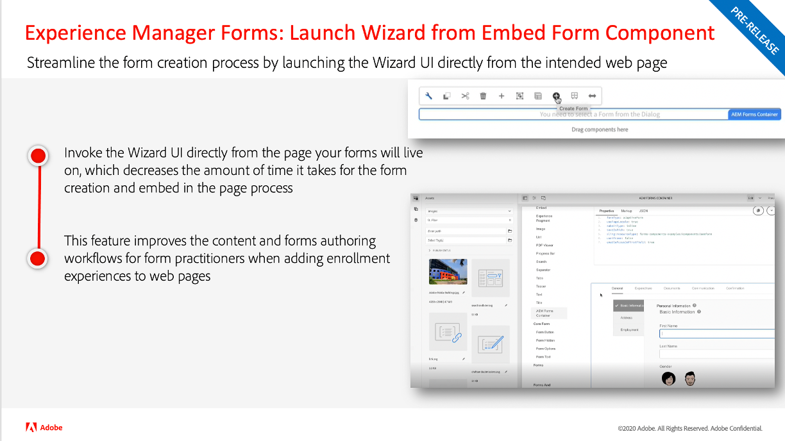

# Adobe Experience Manager as a Cloud Service 릴리스 업데이트

Adobe Experience Manager as a Cloud Service의 최신 기능에 대한 간략한 개요를 확인하십시오. AEM 제품 팀에서 제공하는 약 10분 분량의 짧은 비디오로 최신 릴리스의 하이라이트를 공유합니다.

## 최신 업데이트

<table style="max-width: 50%;">
  <tr>
    <td>
      
      

        <a href="2023/2023-10-0.md">
          <strong>릴리스 | 2023.10.0</strong>
           
        </a>
          <em>릴리스 날짜 2023년 10월 </em>
      

      

        <a href="https://experienceleague.adobe.com/docs/experience-manager-cloud-service/content/release-notes/release-notes/release-notes-current.html">릴리스 정보</a>
      

    </td>
  </tr>  
</table>

## 지난 업데이트

<table style="max-width: 50%;">
  <tr>
      <td>
      
      

        <a href="2023/2023-9-0.md">
          <strong>릴리스 | 2023.9.0</strong>
           
        </a>
          <em>릴리스 날짜 2023년 10월 </em>
      

      

        <a href="https://experienceleague.adobe.com/docs/experience-manager-cloud-service/content/release-notes/release-notes/release-notes-current.html">릴리스 정보</a>
      

    </td>
    <td>
      
      

        <a href="2023/2023-8-0.md">
          <strong>릴리스 | 2023.8.0</strong>
           
        </a>
          <em>릴리스 날짜: 2023년 8월 </em>
      

      

        <a href="https://experienceleague.adobe.com/docs/experience-manager-cloud-service/content/release-notes/release-notes/release-notes-current.html">릴리스 정보</a>
      

    </td>
    <td>
      
      

        <a href="2023/2023-7-0.md">
          <strong>릴리스 | 2023.7.0</strong>
           
        </a>
          <em>릴리스 날짜 2023년 7월 </em>
      

      

        <a href="https://experienceleague.adobe.com/docs/experience-manager-cloud-service/content/release-notes/release-notes/release-notes-current.html">릴리스 정보</a>
      

    </td>
   </tr>
   <tr> 
    <td>
      
      

        <a href="2023/2023-6-0.md">
          <strong>릴리스 | 2023.6.0</strong>
           
        </a>
          <em>릴리스 날짜 2023년 6월 </em>
      

      

        <a href="https://experienceleague.adobe.com/docs/experience-manager-cloud-service/content/release-notes/release-notes/release-notes-current.html">릴리스 정보</a>
      

    </td>
    <td>
      
      

        <a href="2023/2023-4-0.md">
          <strong>릴리스 | 2023.4.0</strong>
           
        </a>
          <em>릴리스 날짜 2023년 4월 </em>
      

      

        <a href="https://experienceleague.adobe.com/docs/experience-manager-cloud-service/content/release-notes/release-notes/release-notes-current.html">릴리스 정보</a>
      

    </td>
    <td>
      
      

        <a href="2023/2023-2-0.md">
          <strong>릴리스 | 2023.2.0</strong>
           
        </a>
          <em>릴리스 일자: 2023년 3월 </em>
      

      

        <a href="https://experienceleague.adobe.com/docs/experience-manager-cloud-service/content/release-notes/release-notes/release-notes-current.html">릴리스 정보</a>
      

    </td>
     </tr>
    <tr>   
    <td>
      
      

        <a href="2023/2023-1-0.md">
          <strong>릴리스 | 2023.1.0</strong>
           
        </a>
          <em>릴리스 일자: 2023년 2월 </em>
      

      

        <a href="https://experienceleague.adobe.com/docs/experience-manager-cloud-service/content/release-notes/release-notes/release-notes-current.html">릴리스 정보</a>
      

    </td>
    <td>
      
      

        <a href="2022/2022-10-0.md">
          <strong>릴리스 | 2022.10.0</strong>
           
        </a>
          <em>릴리스 일자: 2022년 10월 13일 </em>
      

      

        <a href="https://experienceleague.adobe.com/docs/experience-manager-cloud-service/content/release-notes/release-notes/release-notes-current.html">릴리스 정보</a>
      

    </td>
    <td>
      
      

        <a href="2022/2022-8-0.md">
          <strong>릴리스 | 2022.8.0</strong>
           
        </a>
          <em>릴리스 일자: 2022년 9월 1일 </em>
      

      

        <a href="https://experienceleague.adobe.com/docs/experience-manager-cloud-service/content/release-notes/release-notes/release-notes-current.html">릴리스 정보</a>
      

    </td>
   </tr>
</table>

&lt;!— 새 업데이트 —>
<!---
## Latest Update

<table style="max-width: 50%;">
  <tr>
    <td>
      
      

        <a href="2023/2023-11-0.md">
          <strong>Release | 2023.11.0</strong>
           
        </a>
          <em>Release date November 2023 </em>
      

      

        <a href="https://experienceleague.adobe.com/docs/experience-manager-cloud-service/content/release-notes/release-notes/release-notes-current.html">Release notes</a>
      

    </td>
  </tr>  
</table> 

## Past Updates

<table style="max-width: 50%;">
  <tr>
    <td>
      
      

        <a href="2023/2023-10-0.md">
          <strong>Release | 2023.10.0</strong>
           
        </a>
          <em>Release date October 2023 </em>
      

      

        <a href="https://experienceleague.adobe.com/docs/experience-manager-cloud-service/content/release-notes/release-notes/release-notes-current.html">Release notes</a>
      

    </td>
      <td>
      
      

        <a href="2023/2023-9-0.md">
          <strong>Release | 2023.9.0</strong>
           
        </a>
          <em>Release date September 2023 </em>
      

      

        <a href="https://experienceleague.adobe.com/docs/experience-manager-cloud-service/content/release-notes/release-notes/release-notes-current.html">Release notes</a>
      

    </td>
    <td>
      
      

        <a href="2023/2023-8-0.md">
          <strong>Release | 2023.8.0</strong>
           
        </a>
          <em>Release date August 2023 </em>
      

      

        <a href="https://experienceleague.adobe.com/docs/experience-manager-cloud-service/content/release-notes/release-notes/release-notes-current.html">Release notes</a>
      

    </td>
</tr>
<tr>    
    <td>
      
      

        <a href="2023/2023-7-0.md">
          <strong>Release | 2023.7.0</strong>
           
        </a>
          <em>Release date July 2023 </em>
      

      

        <a href="https://experienceleague.adobe.com/docs/experience-manager-cloud-service/content/release-notes/release-notes/release-notes-current.html">Release notes</a>
      

    </td>
    <td>
      
      

        <a href="2023/2023-6-0.md">
          <strong>Release | 2023.6.0</strong>
           
        </a>
          <em>Release date June 2023 </em>
      

      

        <a href="https://experienceleague.adobe.com/docs/experience-manager-cloud-service/content/release-notes/release-notes/release-notes-current.html">Release notes</a>
      

    </td>
    <td>
      
      

        <a href="2023/2023-4-0.md">
          <strong>Release | 2023.4.0</strong>
           
        </a>
          <em>Release date April 2023 </em>
      

      

        <a href="https://experienceleague.adobe.com/docs/experience-manager-cloud-service/content/release-notes/release-notes/release-notes-current.html">Release notes</a>
      

    </td>
   </tr>
   <tr> 
    <td>
      
      

        <a href="2023/2023-2-0.md">
          <strong>Release | 2023.2.0</strong>
           
        </a>
          <em>Release date Mar 2023 </em>
      

      

        <a href="https://experienceleague.adobe.com/docs/experience-manager-cloud-service/content/release-notes/release-notes/release-notes-current.html">Release notes</a>
      

    </td>
    <td>
      
      

        <a href="2023/2023-1-0.md">
          <strong>Release | 2023.1.0</strong>
           
        </a>
          <em>Release date  Feb 2023 </em>
      

      

        <a href="https://experienceleague.adobe.com/docs/experience-manager-cloud-service/content/release-notes/release-notes/release-notes-current.html">Release notes</a>
      

    </td>
    <td>
      
      

        <a href="2022/2022-10-0.md">
          <strong>Release | 2022.10.0</strong>
           
        </a>
          <em>Release date  Oct 13, 2022 </em>
      

      

        <a href="https://experienceleague.adobe.com/docs/experience-manager-cloud-service/content/release-notes/release-notes/release-notes-current.html">Release notes</a>
      

    </td>
   </tr>
</table>
--->