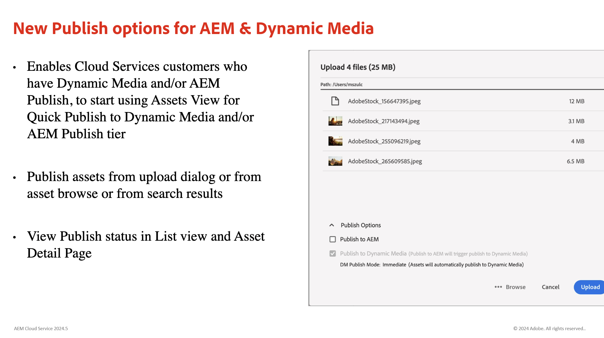
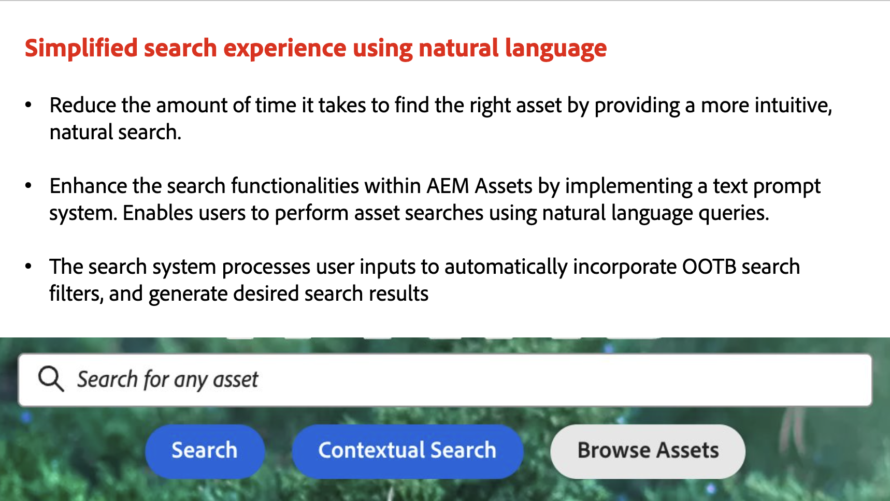

# Adobe Experience Manager as a Cloud Service 릴리스 업데이트

Adobe Experience Manager as a Cloud Service의 최신 기능에 대한 간략한 개요를 확인하십시오. AEM 제품 팀이 제공하는 약 10분 분량의 짧은 비디오로 최신 릴리스의 하이라이트를 공유합니다.

## 최신 업데이트

<table style="max-width: 50%;">
  <tr>
    <td>
      
      

        <a href="2024/2024-5-0.md">
          <strong>릴리스 | 2024.5.0</strong>
        </a>
      

      <em>릴리스 날짜: 2024년 5월 </em>
      

        <a href="https://experienceleague.adobe.com/docs/experience-manager-cloud-service/content/release-notes/release-notes/release-notes-current.html?lang=ko-KR">릴리스 정보</a>
      

    </td>
  </tr>  
</table>

## 지난 업데이트

<table style="max-width: 50%;">
  <tr>
    <td>
      
      

        <a href="2024/2024-4-0.md">
          <strong>릴리스 | 2024.4.0</strong>
           
        </a>
      

      <em>릴리스 날짜 2024년 4월 </em>
    </td>
    <td>
      
      

        <a href="2024/2024-3-0.md">
          <strong>릴리스 | 2024.3.0</strong>
           
        </a>
      

      <em>릴리스 날짜 2024년 4월 </em>
    </td>
    <td>
      
      

        <a href="2024/2024-1-0.md">
          <strong>릴리스 | 2024.1.0</strong>
           
        </a>
          <em>릴리스 날짜 2024년 1월 </em>
      

    </td>
  </tr>
  <tr>
    <td>
      
      

        <a href="2023/2023-11-0.md">
          <strong>릴리스 | 2023.11.0</strong>
           
        </a>
          <em>릴리스 날짜 2023년 11월 </em>
      

    </td>
    <td>
      
      

        <a href="2023/2023-10-0.md">
          <strong>릴리스 | 2023.10.0</strong>
           
        </a>
          <em>릴리스 날짜 2023년 10월 </em>
      

    </td>
    <td>
      
      

        <a href="2023/2023-9-0.md">
          <strong>릴리스 | 2023.9.0</strong>
           
        </a>
          <em>릴리스 날짜 2023년 9월 </em>
      

    </td>
  </tr>
  <tr>    
    <td>
      
      

        <a href="2023/2023-8-0.md">
          <strong>릴리스 | 2023.8.0</strong>
           
        </a>
          <em>릴리스 날짜: 2023년 8월 </em>
      

    </td>
    <td>
      
      

        <a href="2023/2023-7-0.md">
          <strong>릴리스 | 2023.7.0</strong>
           
        </a>
          <em>릴리스 날짜 2023년 7월 </em>
      

    </td>
    <td>
      
      

        <a href="2023/2023-6-0.md">
          <strong>릴리스 | 2023.6.0</strong>
           
        </a>
          <em>릴리스 날짜 2023년 6월 </em>
      

    </td>
  </tr>
</table>
