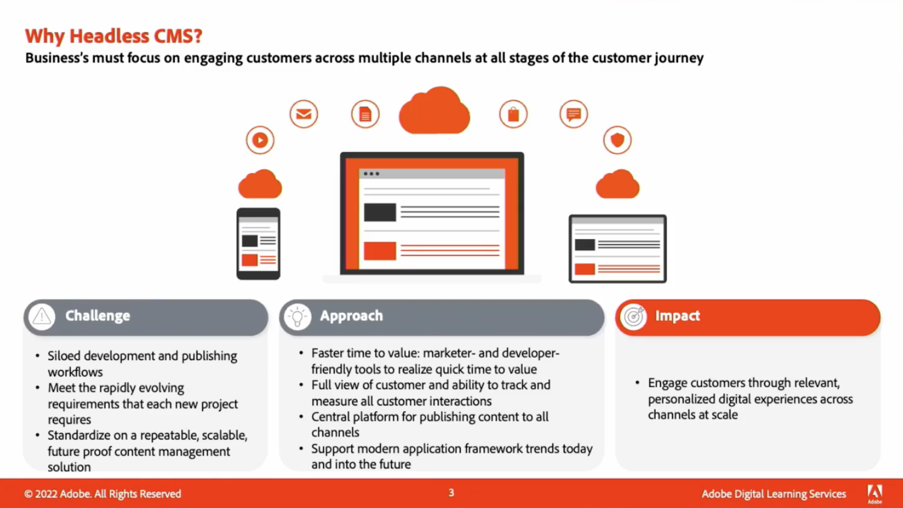

# Content 및 Commerce

매력적인 웹 사이트, 모바일 앱 및 양식을 만들고 관리할 수 있습니다. 또한 유연한 AI 기반 상거래 솔루션을 통해 단일 플랫폼에서 멀티채널 상거래 경험을 구축하는 방법을 살펴볼 수 있습니다.

## 새로운 기능

<table>
<tr>
  <td>
    
     

      <a href="https://experienceleague.adobe.com/docs/skill-builder-events/skill-builder/content-and-commerce/2022/headless.html">
        <strong>Adobe Experience Manager를 통해 헤드리스 경험 제공</strong>
      </a>
    

    

    <em>최신 Experience Manager 콘텐츠 조각 개선 사항 및 헤드리스 콘텐츠 게재를 위한 새로운 GraphQL API를 사용한 헤드리스 경험 관리에 대해 알아봅니다.</em>
    

  </td>
  <td>
    
     

      <a href="https://experienceleague.adobe.com/docs/skill-builder-events/skill-builder/content-and-commerce/2022/metadata.html">
        <strong>Adobe Experience Manager Assets에서 비즈니스에 적합한 메타데이터 활용</strong>
      </a>
    

    

    <em>에셋 태그 지정에 대한 워크로드를 줄이고 에셋을 보다 간편하게 검색할 수 있도록 만들어 AEM Assets에서 메타데이터를 최대한 활용하는 방법에 대해 알아봅니다.</em>
    

  </td>  
  <td>
    
     

      <a href="https://experienceleague.adobe.com/docs/skill-builder-events/skill-builder/content-and-commerce/2022/workflow.html">
        <strong>효율적인 기업 워크플로 관리 활용</strong>
      </a>
    

    

    <em>이 세션에서는 자산 관리를 위한 워크플로우를 사용하여 얻을 수 있는 이점과 워크플로를 신속하게 만드는 방법에 대해 알아봅니다.</em>
    

  </td>
</tr>
</table>

>[!TIP]
>
>**기록된 모든 세션이 왼쪽의 탐색에 나열됩니다**.
