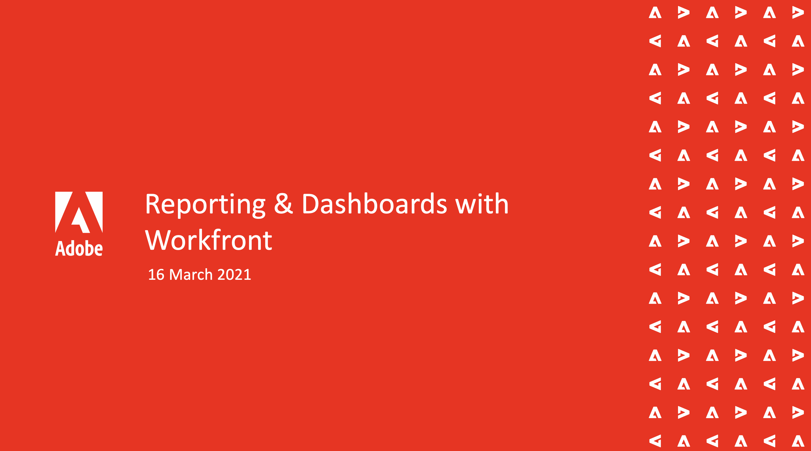

# Workfront 온디맨드 이벤트 {#overview}

전문가와 동료가 Workfront 사용 방법에 대한 생각을 공유하는 녹화된 Workfront 이벤트 라이브러리입니다.

## 특별 포함된 세션

<table>
  <tr>
   <td>
      
      

         <a href="user-groups/workfront-system-maintenance.md"><strong>Workfront 시스템 유지 관리</strong></a>
<!---          <em>foo</em> -->
      

      

         
         시스템 관리자 패널은 시스템 설정, 정기 유지 관리 및 정리에 대해 고려해야 할 사항에 대해 설명합니다.
      

    </td>
   <td>
      
      

         <a href="user-groups/reporting-and-dashboards.md"><strong>보고 및 대시보드</strong></a>
<!---          <em>foo</em> -->
      

      

         
         다른 사용자가 해당 조직을 위해 만든 보고서 및 대시보드와 이들이 학습한 모범 사례를 참조하십시오.
      

    </td>
   <td>
      
      

         <a href="user-groups/agile-in-marketing.md"><strong>마케팅의 애자일</strong></a>
<!---          <em>foo</em> -->
      

      

         
         애자일 전문가들은 애자일, 일반적인 비즈니스 민첩성 및 애자일에 Workfront을 사용하는 방법을 통해 얻은 높은 포인트와 트렌드에 대해 설명합니다.
      

    </td>
  </tr>
</table>
